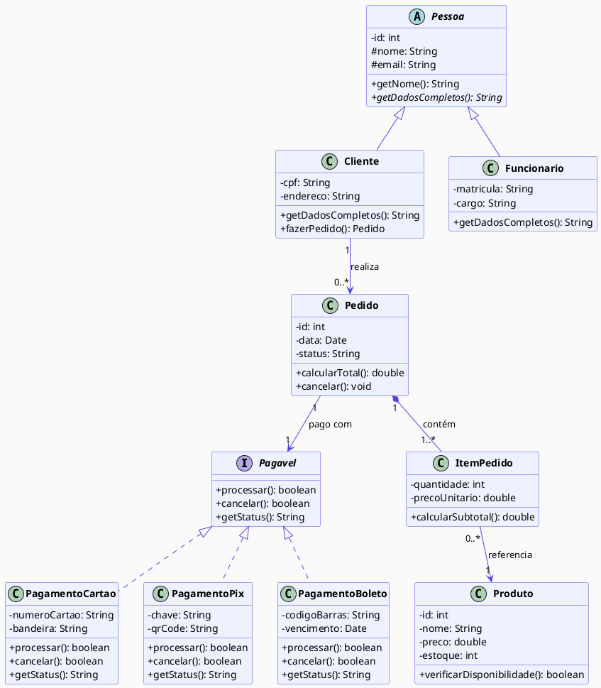

# Diagrama de Classes — Sistema de Pedidos

## Relacionamentos

| Símbolo | Tipo       | Descrição                    |
| ------- | ---------- | ---------------------------- |
| `-->`   | Associação | Uma classe usa/conhece outra |
| `*--`   | Composição | Parte essencial do todo      |
| `o--`   | Agregação  | Parte independente do todo   |
| `<\|--` | Herança    | Herda atributos e métodos    |
| `..>`   | Realização | N                            |

## Modificadores de Acesso

|Símbolo|Acesso|
|---|---|
|`+`|público|
|`-`|privado|
|`#`|protegido|
|`~`|pacote|

## Multiplicidades

| Notação | Significado   |
| ------- | ------------- |
| `1`     | Exatamente um |
| `0..*`  | Zero ou mais  |
| `1..*`  | Um ou mais    |
| `0..1`  | Zero ou um    |